# LinguaWorks

**LinguaWorks** is a research-oriented interactive system that supports **skill-oriented prompt construction** for large language models (LLMs).
It operationalizes the concept of **Prompt Apprenticeship**, a learning-centered framework that scaffolds users in acquiring **transferable prompt construction skills**, rather than merely producing optimized prompts.

---

## Overview

Prompt-based interaction has become a primary mechanism for engaging with LLMs, yet translating high-level intentions into effective prompts remains cognitively demanding.
Existing prompt-support tools predominantly optimize *prompt outcomes* by automatically generating or refining prompts on behalf of users, often neglecting the development of users’ underlying prompt construction skills.

LinguaWorks takes a fundamentally different approach:

> **Prompt quality is an outcome; prompt construction skill is the goal.**

Instead of automating prompt engineering, LinguaWorks structures the prompt construction process as a learning activity, guiding users through iterative reasoning, reflection, and validation.

---

## Prompt Apprenticeship

LinguaWorks is grounded in **Prompt Apprenticeship**, a framework inspired by Cognitive Apprenticeship theory and adapted to human–LLM interaction.

Prompt Apprenticeship emphasizes:

* **Making expert reasoning observable** during prompt construction
* **Guided practice** through structured refinement and constrained modification
* **Reflection and validation** to support generalization beyond immediate system use

The framework distinguishes between:

* **In-task prompt quality** (performance while using the system), and
* **Skill transfer**, measured by users’ ability to construct effective prompts without system assistance.

LinguaWorks is designed explicitly to support both.

---

## System Scope

The current implementation of LinguaWorks focuses on **assistant-style system prompt construction**.
Such prompts define the role, behavior, constraints, and response style of an LLM-based assistant prior to any user interaction.

Rather than treating system prompts as static artifacts, LinguaWorks supports their construction as an iterative, reflective process.

---

## System Overview

LinguaWorks supports prompt construction through a structured, multi-stage workflow that includes:

* **Requirement clarification** via interactive dialogue
* **Explicit analysis of prompt elements and constraints**
* **Guided prompt generation and refinement**
* **Comparative testing and validation** across prompt versions

Throughout the process, the system maintains explicit representations of user intent, intermediate reasoning, and feedback history to scaffold learning-oriented interaction.

---

## Architecture

LinguaWorks adopts a modular, front–back-end–separated architecture consisting of three main components:

* **Main Backend Service (FastAPI)**
  Implements the Prompt Apprenticeship workflow, including clarification, analysis, generation, refinement, and testing.

* **Database API Service (Flask)**
  Provides structured access to persistent data such as sessions, messages, prompt versions, templates, analysis methods, and user configurations.

* **Frontend Client (React + Vite)**
  Supports interactive prompt construction, model configuration, session management, and prompt testing.

---

## Repository Structure

```
.
├── src/                          # Backend source code
│   ├── api/                      # FastAPI main service & Flask database API
│   ├── core/                     # Prompt Apprenticeship workflow logic
│   ├── infrastructure/           # Configuration, models, migrations
│   └── agent_prompt/             # Agent prompt resources
├── frontend/                     # Frontend application (Vite + React)
├── prompt_optimizer_database.sql # MySQL initialization script
├── requirements.txt              # Python dependencies
├── start_main_app.py             # FastAPI service entry point
└── start_database.py             # Database API service entry point
```

---

## Quick Start (Local Development)

### Prerequisites

* Python ≥ 3.12
* Node.js ≥ 16
* MySQL ≥ 8.x

---

### 1. Initialize the Database

Create a MySQL database and import the initialization script:

```bash
mysql -u root -p prompt_optimizer < prompt_optimizer_database.sql
```

---

### 2. Backend Configuration

Create a `.env` file in the project root directory. Example:

```env
APP_ENV=development
DEBUG=true

FASTAPI_HOST=127.0.0.1
FASTAPI_PORT=8000
FLASK_HOST=127.0.0.1
FLASK_PORT=5001

DB_HOST=localhost
DB_PORT=3306
DB_NAME=prompt_optimizer
DB_USER=root
DB_PASSWORD=root

CORS_ORIGINS=http://localhost:3000
```

---

### 3. Start Backend Services

```bash
pip install -r requirements.txt
python start_database.py
python start_main_app.py
```

* FastAPI API docs: [http://localhost:8000/docs](http://localhost:8000/docs)
* Database API: [http://localhost:5001/api](http://localhost:5001/api)

---

### 4. Frontend Configuration & Startup

Create `frontend/.env.local`:

```env
VITE_API_BASE_URL=http://localhost:8000
VITE_DB_API_BASE_URL=http://localhost:5001/api
```

Then run:

```bash
cd frontend
npm install
npm run dev
```

Open [http://localhost:3000](http://localhost:3000)

---

## Configuration Validation

LinguaWorks includes a configuration validation utility that checks environment variables, database connectivity, and runtime setup:

```bash
python -m src.infrastructure.config.validation
```

---

## Development & Testing

### Backend

```bash
python -m pytest
python -m black --check src tests start_database.py start_main_app.py
```

### Frontend

```bash
npm run lint
npm run type-check
```

---
## Examples
### 1.🎨 Idea Incubator
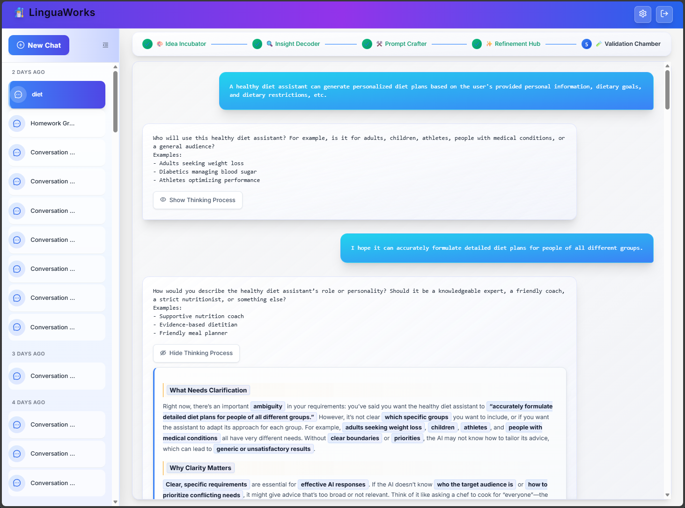
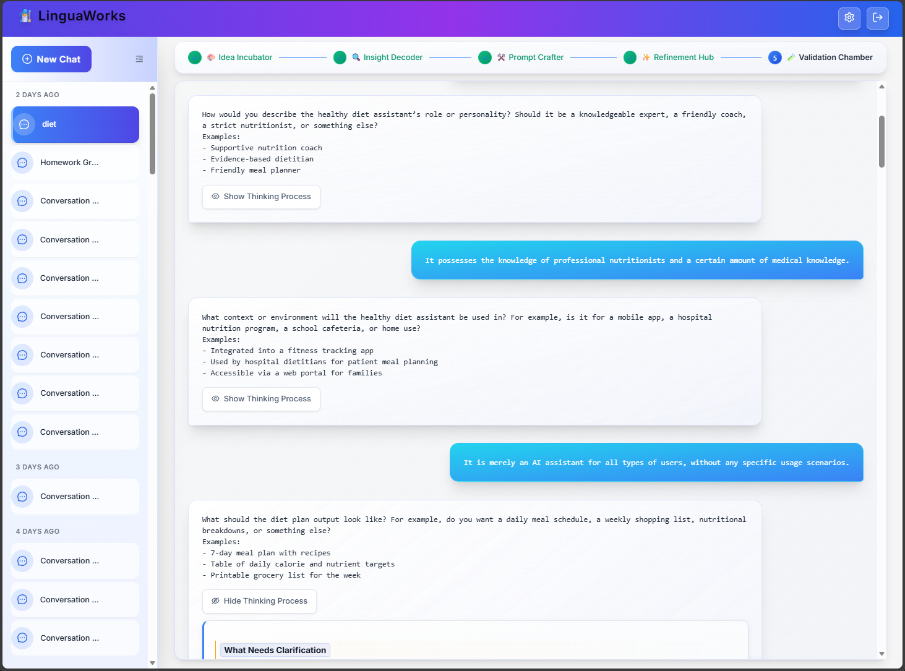
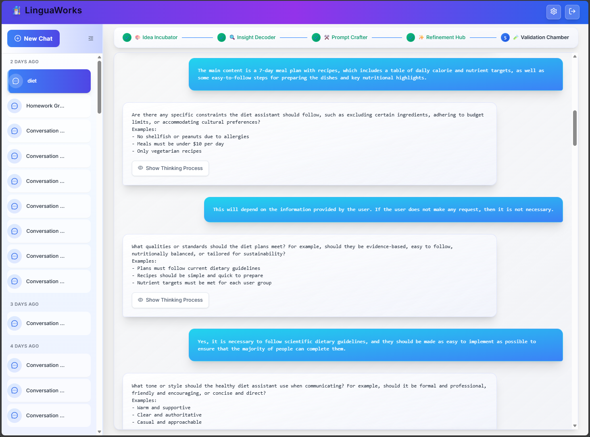
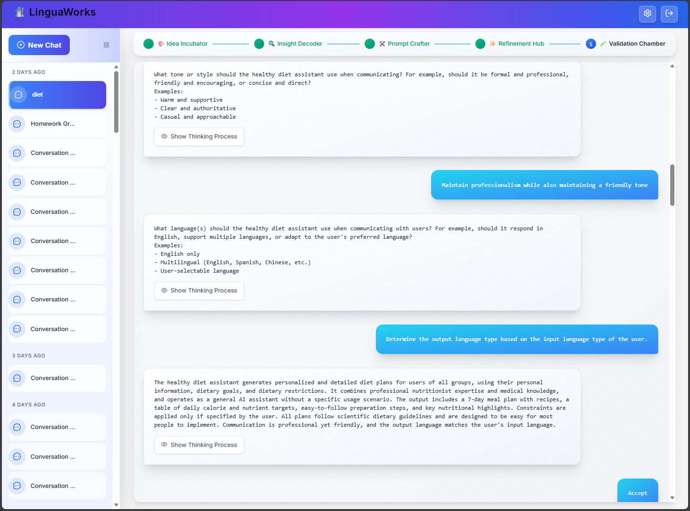

### 2.🔍 Insight Decoder
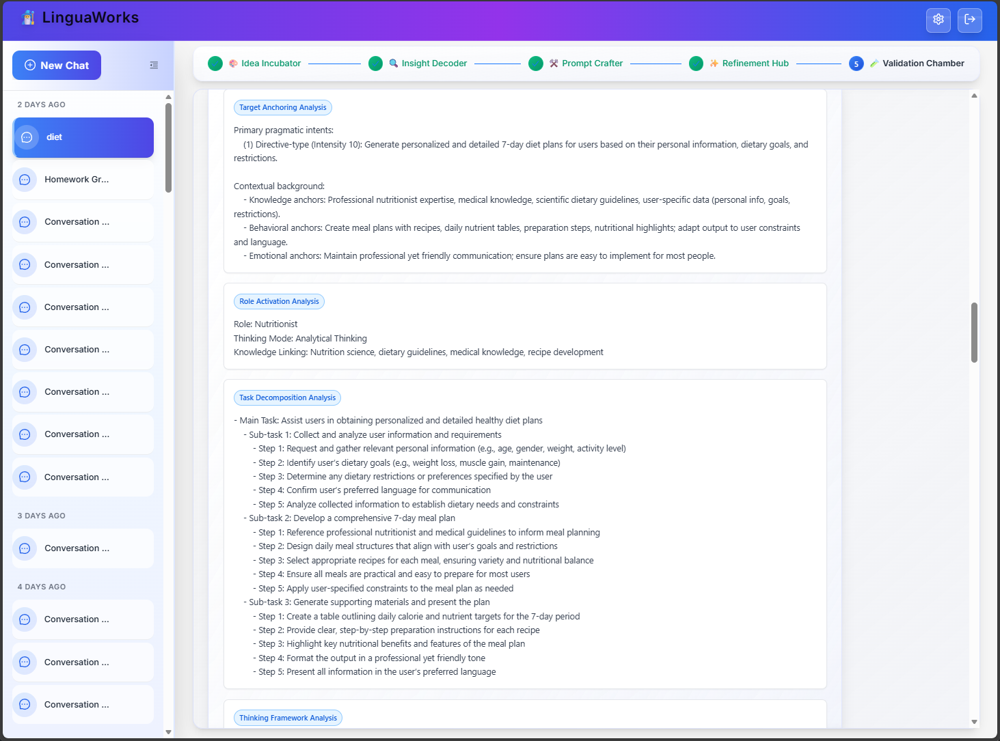
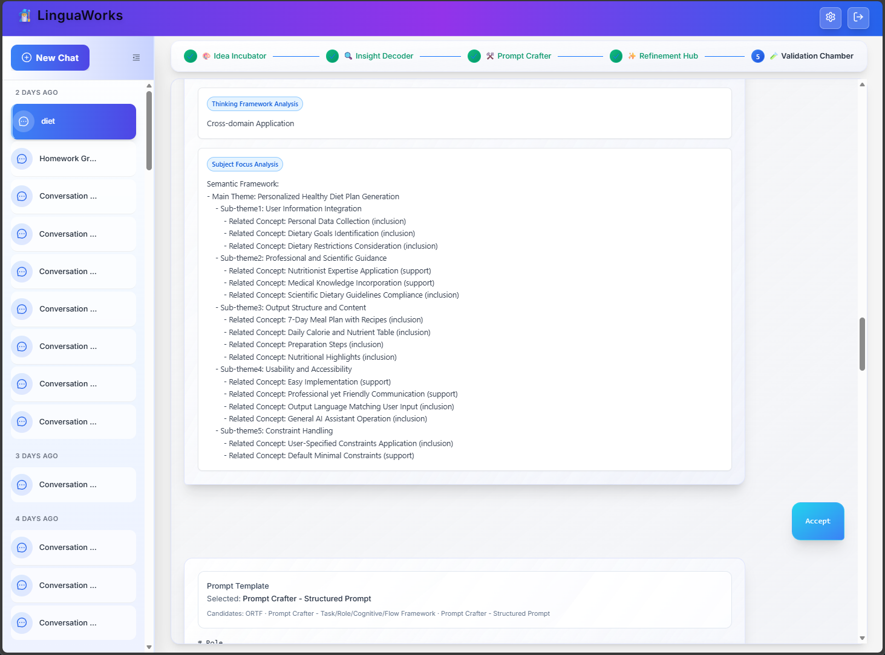

### 3.⚒️ Prompt Crafter
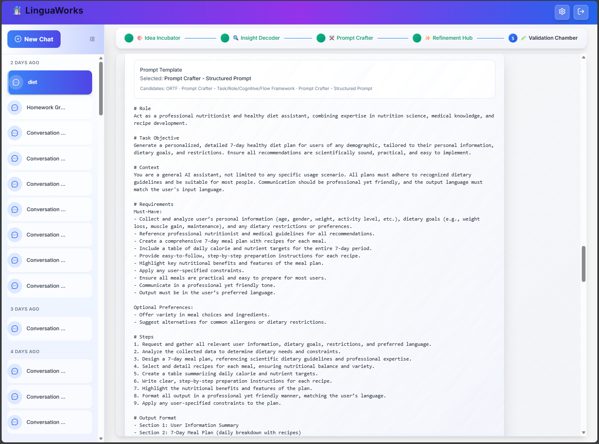


### 4.✨ Refinement Hub

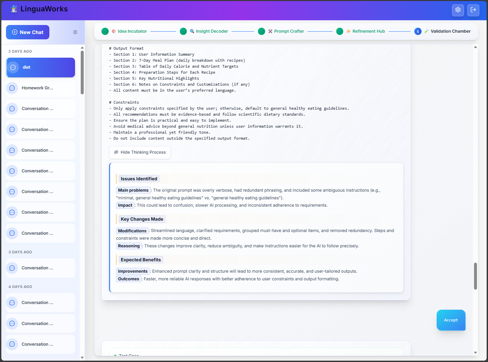

### 5.🧪 Validation Chamber
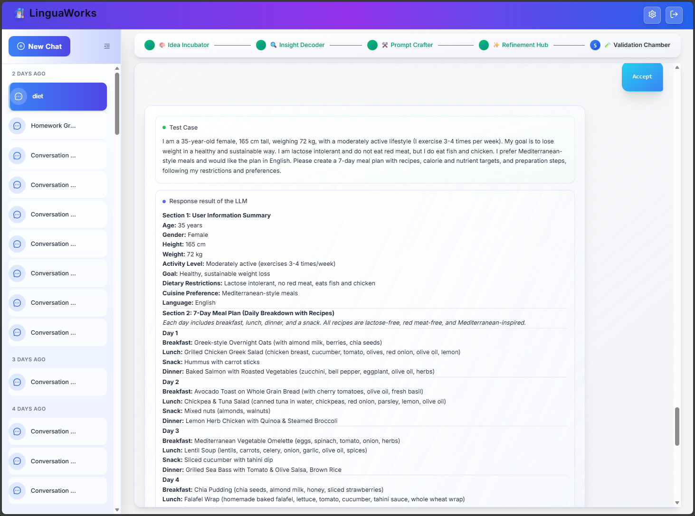
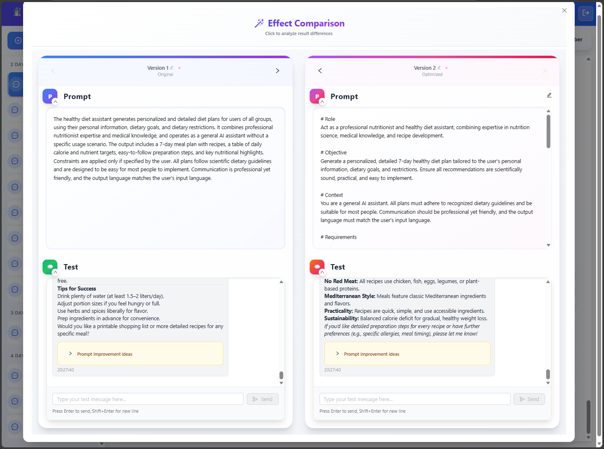
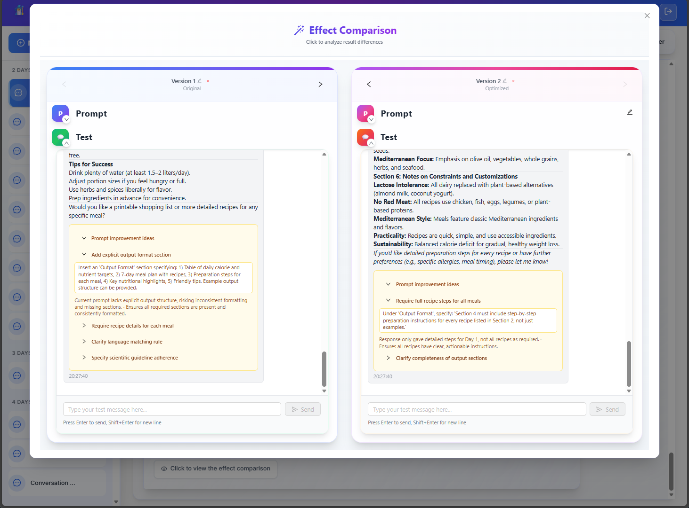
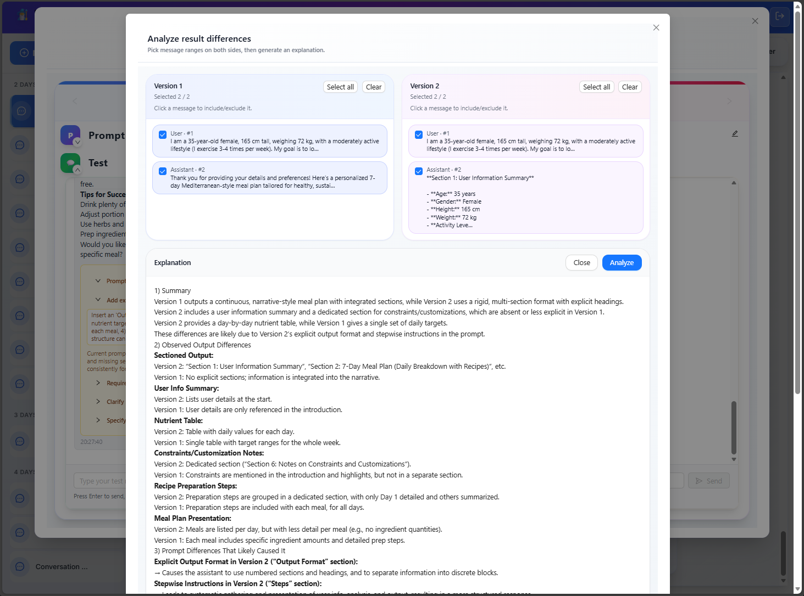

## License

This project is released for research and academic use.
